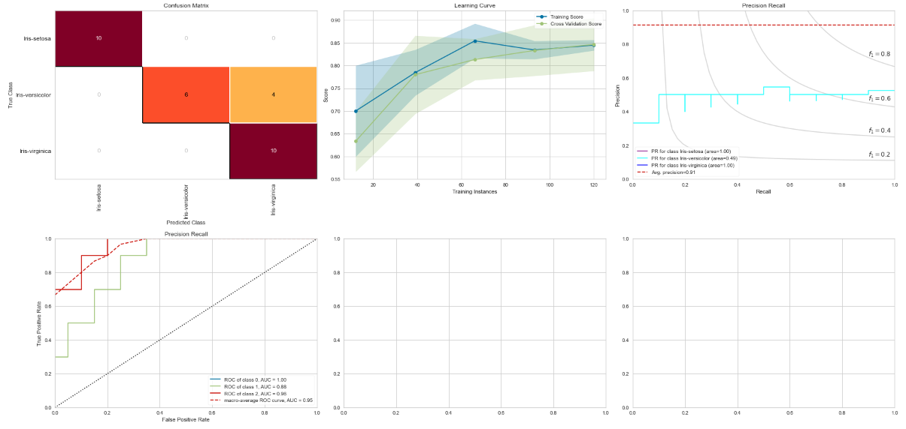
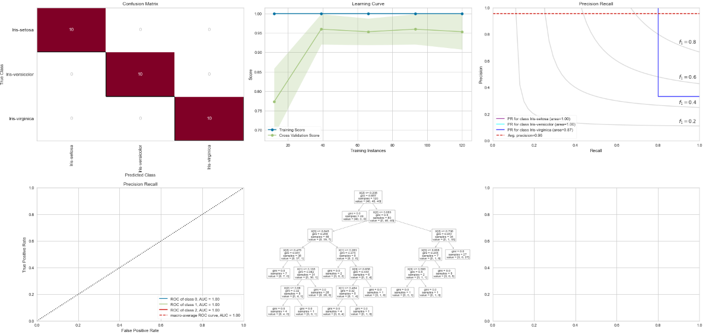
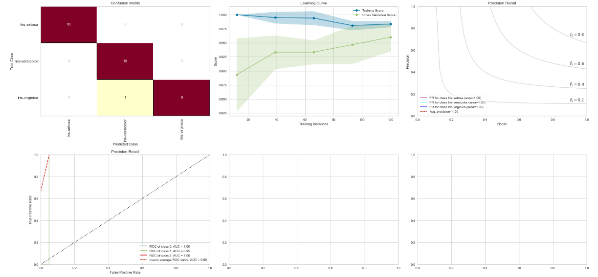
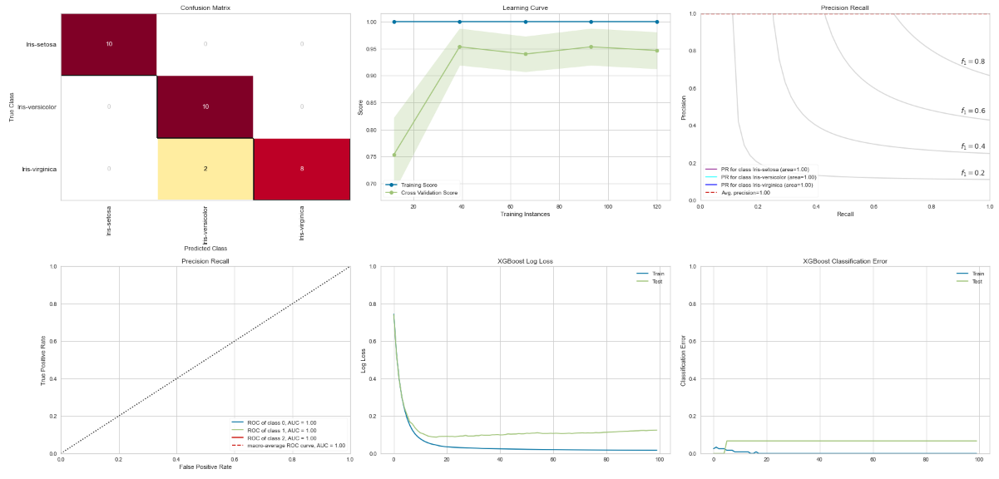
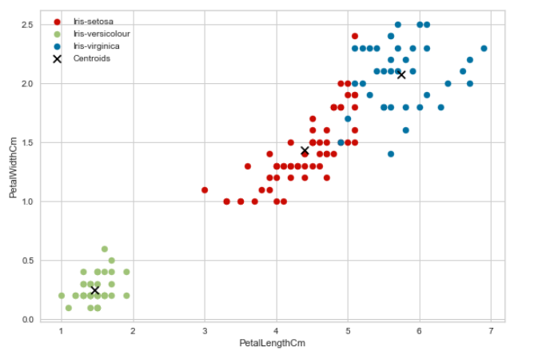

## The Iris Dataset
### In this notebook, many Machine Learning Algorithms were implemented on the Iris Dataset.
### The Iris Dataset is one of the "Hello World" problems in Machine Learning.
#### The notebook iris.ipynb contains detailed explanation and analysis about the work done

### The Machine Learning **(ML)** Algorithms used are:
* __[Supervised Learning:](https://www.ibm.com/cloud/blog/supervised-vs-unsupervised-learning#:~:text=for%20your%20situation.-,What%20is%20supervised%20learning%3F,-Supervised%20learning%20is)__
    * __[Logistic Regression](https://scikit-learn.org/stable/modules/generated/sklearn.linear_model.LogisticRegression.html)__ 
        Result: 
        
    * __[Decision Tree](https://scikit-learn.org/stable/modules/tree.html)__ 
        Result: 
        
    * __[Support Vector Machine](https://scikit-learn.org/stable/modules/generated/sklearn.svm.SVC.html)__ 
        Result: 
        
    * __[XGBoost](https://xgboost.readthedocs.io/en/stable/install.html)__ 
        Result: 
        
  
* __[Unsupervised Learning:](https://www.ibm.com/cloud/blog/supervised-vs-unsupervised-learning#:~:text=and%20polynomial%20regression.-,What%20is%20unsupervised%20learning%3F,-Unsupervised%20learning%20uses)__
    * __[K-means](https://scikit-learn.org/stable/modules/generated/sklearn.cluster.KMeans.html)__ 
        Result: 
        
 
 
